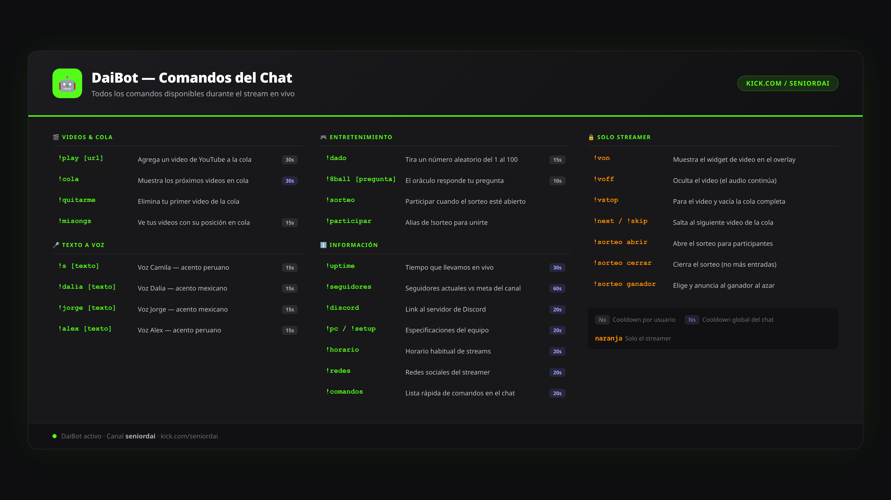

# DaiBot — Bot de Stream para Kick.com

Bot de streaming para el canal **SeniorDai** en Kick.com. Maneja el chat, reproduce videos de YouTube pedidos por el chat, hace text-to-speech, gestiona sorteos y muestra un overlay animado en OBS.

---

## ¿Qué hace?

| Función | Descripción |
|---|---|
| 💬 Chat en vivo | Lee el chat de Kick y responde a comandos |
| 🎬 Cola de videos | El chat pide videos de YouTube con `!play` |
| 🔊 Text-to-Speech | El chat hace hablar al bot con `!s` y otras voces |
| 🎮 Entretenimiento | Dados, 8-ball y sorteos con `!dado`, `!8ball`, `!sorteo` |
| 📢 Respuestas automáticas | Discord, PC, horario, seguidores, uptime… |
| 🛡️ Anti-spam | Cooldowns por usuario y globales en todos los comandos |
| 📺 Overlay OBS | Pantalla animada estilo pixel art con stats y reproductor |
| 👥 Meta de seguidores | Barra de progreso en tiempo real vía Pusher |
| 💻 Stats del sistema | CPU, RAM y temperatura en el overlay |

---

## Requisitos

- **Rust** — [rustup.rs](https://rustup.rs) (el script lo instala solo si falta)
- **Node.js** — para el login OAuth de Kick
- **Python edge-tts** — para el text-to-speech

```bash
pip install edge-tts
```

---

## Configuración

**1. Clonar el repositorio**
```bash
git clone https://github.com/steepsalvadorman/DaiBotkick.git
cd DaiBotkick
```

**2. Crear tu `.env`**
```bash
cp .env.example .env
```

**3. Editar `.env` con tus datos** — lo mínimo:
```env
CHANNEL_NAME=tu_canal_de_kick

KICK_CLIENT_ID=      # kick.com/settings/developer
KICK_CLIENT_SECRET=  # kick.com/settings/developer

# Respuestas automáticas del chat
CMD_DISCORD=https://discord.gg/tu-link
CMD_REDES=Tus redes sociales aquí
CMD_PC=CPU: ... | GPU: ... | RAM: ...
CMD_HORARIO=Lunes a viernes de 18:00 a 22:00
```

Los tokens OAuth se llenan automáticamente al hacer login.

---

## Cómo iniciar

```bash
./autorun.sh
```

El script hace todo solo:
1. Verifica Rust y Node.js
2. Abre el navegador para autorizar el bot en Kick (primera vez)
3. Compila el backend en Rust
4. Arranca el bot y lo reinicia si se cae

---

## Configurar OBS

Agrega una **Browser Source** con estos ajustes:

| Campo | Valor |
|---|---|
| URL | `http://localhost:3000/pixel.html` |
| Ancho | `1920` |
| Alto | `1080` |
| Controlar audio vía OBS | ✅ Marcado |
| CSS personalizado | `body { background-color: rgba(0,0,0,0); margin: 0; overflow: hidden; }` |

> ⚠️ Usa **una sola** browser source. Refrescar crea una segunda conexión.

---

## Comandos del chat



### Cualquiera del chat

| Comando | Descripción | Cooldown |
|---|---|---|
| `!play [url]` | Agrega un video de YouTube a la cola | 30s por usuario |
| `!cola` | Muestra los próximos videos en cola | 30s global |
| `!quitarme` | Elimina tu primer video de la cola | — |
| `!misongs` | Ve tus videos con su posición en cola | 15s por usuario |
| `!s [texto]` | TTS voz Camila (acento peruano) | 15s por usuario |
| `!dalia [texto]` | TTS voz Dalia (mexicano) | 15s por usuario |
| `!jorge [texto]` | TTS voz Jorge (mexicano) | 15s por usuario |
| `!alex [texto]` | TTS voz Alex (peruano) | 15s por usuario |
| `!dado` | Número aleatorio del 1 al 100 | 15s por usuario |
| `!8ball [pregunta]` | El oráculo responde | 10s por usuario |
| `!sorteo` / `!participar` | Entrar al sorteo cuando esté abierto | — |
| `!uptime` | Tiempo que llevamos en vivo | 30s global |
| `!seguidores` | Seguidores actuales vs meta | 60s global |
| `!discord` | Link al servidor de Discord | 20s global |
| `!redes` | Redes sociales | 20s global |
| `!pc` / `!setup` | Especificaciones del equipo | 20s global |
| `!horario` | Horario de streams | 20s global |
| `!comandos` / `!help` | Lista rápida de comandos | 20s global |

### Solo el streamer

| Comando | Descripción |
|---|---|
| `!von` | Muestra el widget de video en el overlay |
| `!voff` | Oculta el video (el audio continúa) |
| `!vstop` | Para el video y vacía la cola |
| `!next` / `!skip` | Salta al siguiente video |
| `!sorteo abrir` | Abre el sorteo para participantes |
| `!sorteo cerrar` | Cierra el sorteo |
| `!sorteo ganador` | Elige y anuncia al ganador al azar |

---

## Imagen de comandos

El archivo `comandos.png` (4K, 3840×2160) es una imagen lista para subir a la información del stream. Para regenerarla:

```bash
./make-comandos.sh
```

---

## Estructura del proyecto

```
DaiBotkick/
├── autorun.sh          ← Inicia el bot (instala deps, autentica, compila)
├── make-comandos.sh    ← Genera comandos.png en alta resolución
├── comandos.html       ← Fuente del diseño de la imagen de comandos
├── comandos.png        ← Imagen de comandos lista para el stream (4K)
├── .env                ← Credenciales (NO se sube a git)
├── .env.example        ← Plantilla de configuración
│
├── backend/            ← Servidor en Rust (axum + socketioxide)
│   └── src/
│       ├── main.rs         Punto de entrada y AppState
│       ├── commands/       Lógica de todos los comandos del chat
│       ├── cooldown.rs     Anti-spam: cooldowns por usuario y globales
│       ├── kick/           Conexión al chat de Kick.com (Pusher WebSocket)
│       ├── tts/            Text-to-speech vía edge-tts (Python CLI)
│       ├── queue/          Cola de videos con persistencia en disco
│       ├── server/         WebSocket con el overlay (Socket.IO)
│       └── stats/          CPU/RAM en tiempo real
│
├── overlay/            ← Archivos servidos al OBS
│   └── pixel.html          Overlay principal (pixel art, chat, reproductor)
│
├── login/              ← Login OAuth de Kick
│   └── login.js
│
└── data/               ← Datos en tiempo real (no en git)
    └── tts_cache/          Cache de audios MP3 generados
```

---

## Tecnologías

- **Backend:** Rust — [Axum](https://github.com/tokio-rs/axum), [socketioxide](https://github.com/Totodore/socketioxide), tokio, reqwest
- **Overlay:** HTML + CSS + JavaScript vanilla
- **Chat:** Kick.com API v1 (OAuth 2.0) + Pusher WebSocket
- **TTS:** [edge-tts](https://github.com/rany2/edge-tts) — voces de Microsoft Edge, gratis
- **Videos:** YouTube IFrame con autoplay y unmute vía postMessage

---

## Tests

```bash
cd backend && cargo test
```

43 tests unitarios cubriendo: cooldowns, cola de videos, voces TTS, parsing de URLs de YouTube y helpers de configuración.

---

## Solución de problemas

**El bot no se conecta al chat**
→ Corre `./autorun.sh` de nuevo para renovar el token OAuth

**No se escucha el TTS**
→ Verifica que `edge-tts` esté instalado: `pip install edge-tts`
→ Verifica que "Controlar audio vía OBS" esté marcado en la browser source

**El video no reproduce**
→ Asegúrate de tener una sola browser source en OBS
→ El video aparece automáticamente cuando alguien usa `!play`

**El bot arranca pero no responde en el chat**
→ Verifica que el token OAuth sea válido: comprueba los logs de `autorun.sh`

**El overlay se ve cortado**
→ El overlay está diseñado para 1920×1080. Verifica las dimensiones en OBS
